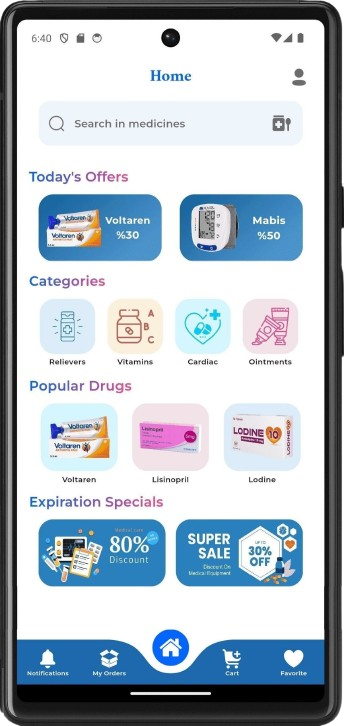

   

 
 

    

 
 
 
 

# **Bio Medika** 💊

**Bio Medika** is a sophisticated mobile application 📱 designed specifically for pharmacy owners 💊 to streamline the process of purchasing medicines from drug warehouses. The app facilitates an efficient, secure, and user-friendly experience, focusing on optimizing the procurement and management of pharmaceutical products.

With **Bio Medika**, pharmacy owners can seamlessly browse a comprehensive catalog of medicines 📚, access real-time inventory updates 🔄, and benefit from exclusive offers and discounts 🎁. The application is built to enhance the ordering process, providing features that ensure efficient transaction management 💼 and timely updates ⏰.

**Bio Medika** offers an array of specialized features to support pharmacy owners in their procurement needs. From managing orders to accessing promotional offers, the application is designed to improve operational efficiency and user satisfaction ⭐.

## Main Sections 🚀

- **Secure Access System** 🔑  
  *Provides pharmacy owners with a secure login and account management system. Includes features for password recovery via email verification to ensure secure access.*

- **Profile Management** 📝 
  *Allows users to create and update their profiles with detailed information such as pharmacy name, contact details, and location.*

- **Medicine Search and Categorization** 🔍💊  
  *Enables users to search for and browse medicines by categories, such as heart medications, blood pressure drugs, and more.*

- **Order Management** 📦  
  *Facilitates the placement and tracking of orders from drug warehouses, including modifications to quantities and real-time order status updates.*

- **Discount and Expiry Tracking** 🕒💥  
  *Displays and manages discounts on medicines approaching their expiration date, with varying discount rates based on shelf life.*

- **Notification System** 🔔  
  *Sends timely updates on order status, special offers, and other critical information, with color-coded notifications for different alert types.*

- **Favorites List** ⭐  
  *Enables users to save frequently ordered medicines for quick access and reordering.*

- **Advanced Search Filters** 🎯 
  *Offers extensive filtering and sorting options to refine searches by categories, discounts, and expiration dates.*

- **Promotions and Offers** 🎁  
  *Provides access to special promotions and discounts on medicines, offering cost-saving opportunities.*

- **Multi-language Support** 🌐 
  *Allows users to switch between languages to enhance accessibility and accommodate diverse user preferences.*

## Noteworthy Features 🌟

- **Order Tracking System** 📦  
  *Detailed tracking of medicine orders, including updates on delivery, cancellation, or pending status, with visibility into final prices and discounts.*

- **Efficient Search and Filtering** 🔍 
  *Advanced search capabilities and filtering options for locating medicines based on specific categories, discounts, and expiration details.*

- **Profile and Account Management** 📝 
  *Manage personal profiles, including updates to personal details, profile pictures, and account settings, with access to order and notification histories.*

- **Password Management** 🔐 
  *Recover lost passwords and update account credentials securely through the application.*

- **Onboarding and Splash Screen** 🌟  
  *An engaging splash screen introduces users to the application, followed by an onboarding process highlighting key features and benefits.*

- **Shopping Basket and Order Processing** 🛒  
  *Manage multiple items in a shopping basket, adjust quantities, and place orders with drug warehouses efficiently.*
  
# Screenshots 📸

Explore the intuitive and user-friendly design of the **Bio Medika** app through these mockups. 🖼️ See how the streamlined interface facilitates easy navigation 🧭 and efficient management of medicine orders 💊.

  

    
    
    
    
    
  

  

    
    
    
    
    
  

  

    
    
    
    
    
  

  

    
    
    
    
    
  

 

    
    
    
    
    
  

  

    
    
    
    
    
  

